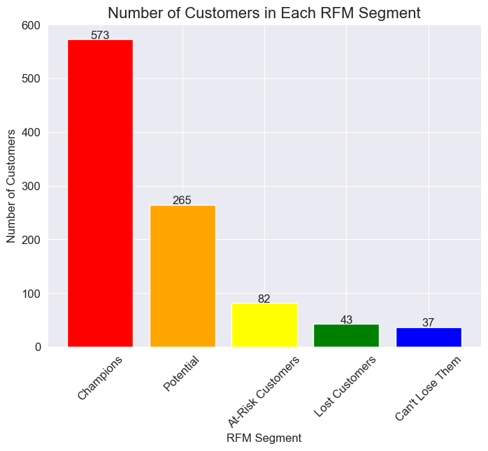

# E-Commerce RFM Analysis

### Introduction

RFM analysis is a powerful technique used by companies to better understand customer behaviour and optimize engagement strategies. It revolves around three key dimensions: recency, frequency, and monetary value. These dimensions capture essential aspects of customer transactions, providing valuable information for segmentation and personalized marketing campaigns.

The given dataset is provided by an e-commerce platform containing customer transaction data including customer ID, purchase date, transaction amount, product information, ID command and location. The platform aims to leverage RFM (recency, frequency, monetary value) analysis to segment customers and optimize customer engagement strategies.

-   [x] RFM analysis is a powerful technique used by companies to better understand customer behaviour and optimize engagement strategies. It revolves around three key dimensions: recency, frequency, and monetary value.

-   [x] These dimensions capture essential aspects of customer transactions, providing valuable information for segmentation and personalized marketing campaigns.

-   [x] The given dataset is provided by an e-commerce platform containing customer transaction data including customer ID, purchase date, transaction amount, product information, ID command and location.

-   [x] The platform aims to leverage RFM (recency, frequency, monetary value) analysis to segment customers and optimize customer engagement strategies.

#### Task

-   [x] Perform RFM analysis on the given dataset and segment customers into different groups based on their RFM scores.
-   [x] Provide a detailed analysis of the customer segments and actionable insights for the platform to optimize customer engagement strategies.
-   [x] The analysis should provide insights into customer behavior and identification of high-value customers, at-risk customers, and potential opportunities for personalized marketing campaigns.

### Requirements

-   [x] Python 3.6+
-   [x] Jupyter Notebook
-   [x] Pandas
-   [x] Numpy
-   [x] Matplotlib
-   [x] Seaborn

### Usage

1.  Clone the repository to your local machine
2.  Open the `EDA.ipynb` file in Jupyter Notebook or Vscode
3.  Run the code cells in the notebook to perform RFM analysis on the dataset and segment customers into different groups based on their RFM scores.
4.  The analysis should provide insights into customer behavior and identification of high-value customers, at-risk customers, and potential opportunities for personalized marketing campaigns.

### Three Main Metrics used in RFM analysis:

1.  Recency: This metric measures how recently a customer has made a purchase. Customers who have made a purchase more recently are generally considered to be more valuable than those who have not made a purchase in a long time.

2.  Frequency: This metric measures how often a customer makes a purchase. Customers who make purchases more frequently are generally considered to be more valuable than those who make purchases less frequently.

3.  Monetary: This metric measures how much a customer spends on each purchase. Customers who spend more money per purchase are generally considered to be more valuable than those who spend less money per purchase.

By combining these three metrics, RFM analysis can be used to segment customers into different groups based on their overall value to the business. These segments can then be used to develop targeted marketing strategies and improve customer retention.

### K-Means Clustering

1.  we used K-means clustering to segment customers based on their RFM scores. RFM stands for Recency, Frequency, and Monetary, and is a commonly used framework for customer segmentation in marketing.
2.  By clustering customers based on their RFM scores, we can identify groups of customers with similar behavior and develop targeted marketing strategies for each segment.
3.  K-means clustering is a popular clustering algorithm because it is simple, fast, and effective for many applications. The algorithm works by iteratively assigning data points to the nearest cluster centroid and updating the centroids based on the mean of the assigned data points. The number of clusters is specified by the user, and the algorithm tries to minimize the within-cluster sum of squares (WCSS) to create compact and well-separated clusters.

##### How Does K-means works:

Here's the mathematical formula for K-means clustering

Given a dataset $X = {x1, x2, …, x_n}$ and a number of clusters k, the K-means algorithm aims to partition the data into $k$ clusters $C = {C1, C2, …, C_k}$ such that the within-cluster sum of squares (WCSS) is minimized:

$$
[\underset{C}{\operatorname{argmin}} \sum_{i=1}^{k} \sum_{x \in C_i} ||x - \mu_i||^2]
$$

where $\mu_i$ is the mean of the data points in cluster $C_i$

The algorithm works by iteratively assigning data points to the nearest cluster centroid and updating the centroids based on the mean of the assigned data points. The number of clusters k is specified by the user, and the algorithm tries to minimize the WCSS to create compact and well-separated clusters.

### Results

The analysis provides insights into customer behavior and identification of high-value customers, at-risk customers, and potential opportunities for personalized marketing campaigns. The following tasks were performed:

-   RFM analysis was performed on the given dataset to segment customers into different groups based on their RFM scores.

-   A detailed analysis of the customer segments was provided, including the distribution of RFM scores, the characteristics of each segment, and actionable insights for the platform to optimize customer engagement strategies.

    The following table shows the RFM customer segments and their corresponding RFM score ranges:

    | RFM Customer Segment | RFM Score Range |
    |----------------------|-----------------|
    | Champions            | 9-15            |
    | Potential            | 6-8             |
    | At-Risk Customers    | 5               |
    | Can't Lose Them      | 4-5             |
    | Lost Customers       | 3               |

    The code block below creates a new column called `RFM Customer Segments` in the `data` DataFrame and assigns the corresponding segment for each customer based on their RFM score:

    ``` python
    #create a new column for RFM customer segments
    data['RFM Customer Segments'] = ''
    #assign the RFM customer segments
    data.loc[data['RFM Score'] >= 9, 'RFM Customer Segments'] = 'Champions'
    data.loc[(data['RFM Score'] >= 6) & (data['RFM Score'] < 9), 'RFM Customer Segments'] = 'Potential'
    data.loc[(data['RFM Score'] >= 5) & (data['RFM Score'] < 6), 'RFM Customer Segments'] = 'At-Risk Customers'
    data.loc[(data['RFM Score'] >= 4) & (data['RFM Score'] <5), 'RFM Customer Segments'] = 'Can\'t Lose Them'
    data.loc[(data['RFM Score']>=3) & (data['RFM Score'] <4), 'RFM Customer Segments'] = 'Lost Customers'
    ```

    The code block assigns the 'Champions' segment to customers with an RFM score of 9 or higher, the 'Potential' segment to customers with an RFM score between 6 and 8, the 'At-Risk Customers' segment to customers with an RFM score of 5, the 'Can't Lose Them' segment to customers with an RFM score between 4 and 5, and the 'Lost Customers' segment to customers with an RFM score between 3 and 4.

#### Numbers of Customers in Each Segment Results



### Conclusion

The RFM analysis provides valuable insights into customer behavior and segmentation, enabling the platform to optimize customer engagement strategies and improve customer satisfaction. The platform can use the insights gained from the analysis to identify high-value customers, at-risk customers, and potential opportunities for personalized marketing campaigns.

$$
argmin_{C_1, \ldots, C_K} \sum_{k=1}^{K} \sum_{x \in S_k} | x - C_k |^2
$$

In summary, clustering is a powerful technique for grouping similar data points together, and K-means clustering is a popular algorithm for many applications, including customer segmentation. By using clustering to identify groups of customers with similar behavior, we can develop targeted marketing strategies to improve customer retention and increase sales.